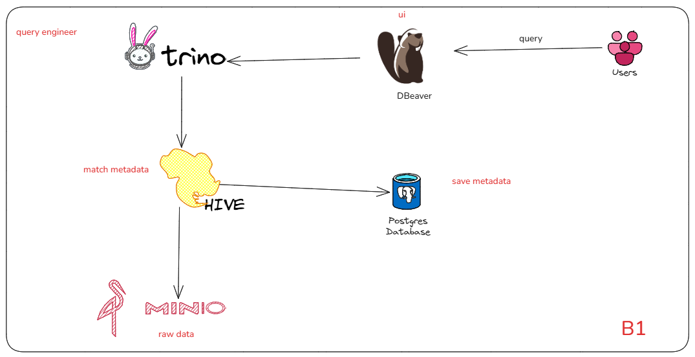

# Diagram

# Data architectures
***Describe how data is managed***
* Collection
* Transformation
* Distribution
* Consumption

## Type of Data architectures
1. Data Fabric: Unify(thống nhất) multiple and disjoint data sources in varios(nhiều loại)
    - Data sources: data warehouses, data lakes, and data marts
    - Environments: on-prem, cloud, and edge
2. Data Mesh: Distribute data ownership to domain-specific teams.  
    - Each team manages, owns, and serves the data as a product
## Type of DMS
1. Data Warehouse
- A central data hub containing highly formatted and structured data for analytics
Eg: GCP, BigQuery, AWS...

2. Data Mart
- A subset of a warehouse to serve a specific domain
Eg: sales, accounting, IT...

3. Data Lake
- A central location for both structured and unstructured data in its raw form.

4. Lake house
- Add layers for data management, governance and query performance on top of Data Lake

## Types of architectures

